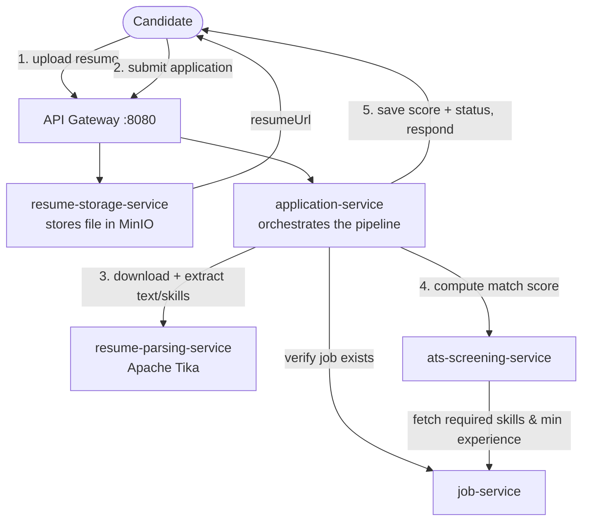

# ATS Screening Platform

[](https://github.com/prajwalmg/ats-screening-app/actions/workflows/ci.yml)

An Applicant Tracking System (ATS) — candidates apply to job postings with a
resume, and the system automatically stores the file, extracts skills and
experience from it, scores it against the job's requirements, and returns a
recommended status (advance / reject / needs human review). It's built as a
set of small Spring Boot microservices behind a single API gateway, with a
React frontend for both the public "apply" flow and an admin console.

The whole pipeline — upload, parse, score, save — runs synchronously within
one HTTP request, so the candidate sees their result immediately with no
polling.

## How it works



**Step by step:**

1. The candidate uploads a resume → **resume-storage-service** saves it and
   returns a `resumeUrl`.
2. The candidate submits the application (name, email, job, `resumeUrl`) →
   **application-service** checks the job exists via **job-service** and
   saves the application as `SUBMITTED`.
3. **application-service** asks **resume-parsing-service** to download the
   resume and extract its text (Apache Tika), then pull out skills (keyword
   match) and years of experience (regex).
4. **application-service** asks **ats-screening-service** to score the
   candidate: it fetches the job's required skills and minimum experience
   from **job-service**, compares them against what was parsed, and returns
   a score plus a recommended status.
5. **application-service** saves the score and status, and returns the full
   result in the same response.

If parsing or screening fails or is unreachable, the application still
saves — it just falls back to `UNDER_REVIEW` with a note, so a human can
pick it up manually. A submission is never silently lost.

## Services

| Service | Port | Responsibility |
|---|---|---|
| `frontend` | 5173 | React app — the apply form and the admin console |
| `api-gateway` | 8080 | Single entry point; routes requests and enforces JWT auth on `/api/admin/**` |
| `job-service` | 8081 | Create/list job postings |
| `application-service` | 8082 | Receives applications and orchestrates parsing + screening |
| `resume-storage-service` | 8083 | Stores resume files (MinIO / S3-compatible) |
| `resume-parsing-service` | 8084 | Extracts text, skills, and years of experience from a resume |
| `ats-screening-service` | 8085 | Scores a candidate against a job's requirements |

`resume-parsing-service` and `ats-screening-service` are stateless — pure
request/response logic with no database of their own.

## Scoring logic

Scoring happens in two parts, always in this order:

1. **Hard experience gate.** If the candidate has fewer years of experience
   than the job requires, the application is auto-rejected — regardless of
   how well their skills match.
2. **Skill match score.** A percentage score is computed and compared
   against a configurable threshold (`SCREENING_ADVANCE_THRESHOLD`, default
   **70%**) to decide between auto-advancing and leaving it for a human to
   review (`UNDER_REVIEW`).

The score itself is computed by a swappable strategy, chosen via the
`SCREENING_STRATEGY` env var:

- **`rule-based` (default)** — score = percentage of the job's required
  skills found in the resume, via keyword matching against a fixed skill
  dictionary. Fully transparent: a rejection can always be explained as
  "matched 3 of 5 required skills."
- **`embedding`** — sends the job description and the resume text to
  OpenAI's `text-embedding-3-small` and scores on cosine similarity between
  the two. Captures semantic matches a keyword scan misses (e.g. "event
  streaming" vs. "Kafka"), at the cost of not being explainable the same
  way. Requires `OPENAI_API_KEY`.

Both strategies feed into the same experience gate and the same
matched/missing-skills breakdown, so the meaning of `REJECTED` /
`ADVANCED` / `UNDER_REVIEW` doesn't change depending on which one is active.

## Running it locally

**Prerequisite:** Docker with Compose v2.

```bash
docker compose up -d --build
```

The first run builds every service's image (a few minutes); after that it's
fast since layers are cached.

Once it's up:

- Frontend: **http://localhost:5173**
- API gateway: **http://localhost:8080**
- Admin login: **admin / admin123** (`/admin/applications`, `/admin/jobs`)
- MinIO console: **http://localhost:9004** (`minioadmin` / `minioadmin`)

To stop everything:

```bash
docker compose down          # keep data
docker compose down -v       # also wipe Postgres/MinIO data
```

### Try it

1. Open **http://localhost:5173/admin/jobs**, sign in, and create a job.
2. Open **http://localhost:5173/apply**, pick that job, fill in the form,
   attach a resume, and submit.
3. The result — status, score, matched/missing skills — shows immediately.
4. Check **http://localhost:5173/admin/applications** to see it listed with
   the same score.

### Running a service from source (optional)

Useful if you're iterating on one service without rebuilding its Docker
image each time. Keep the rest running via Compose, stop just that one
container, then run it locally — it'll pick up the same ports and talk to
the other services via `localhost`:

```bash
docker compose stop application-service
cd application-service
./mvnw spring-boot:run
```

Requires Java 17 for backend services, Node 20.19+ for the frontend
(`cd frontend && npm install && npm run dev`).
